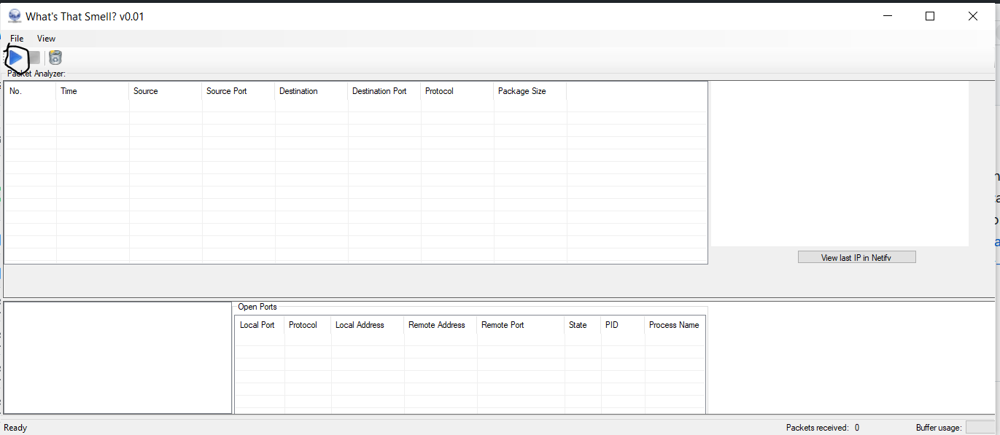
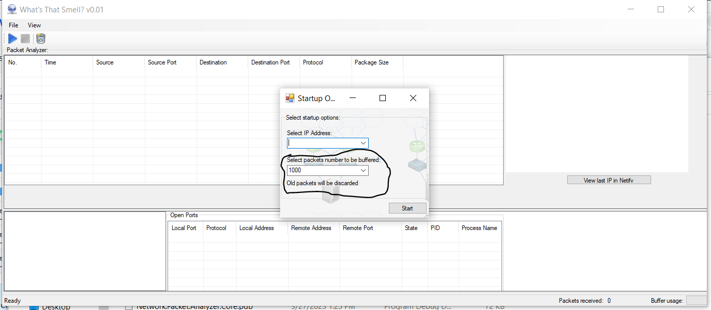
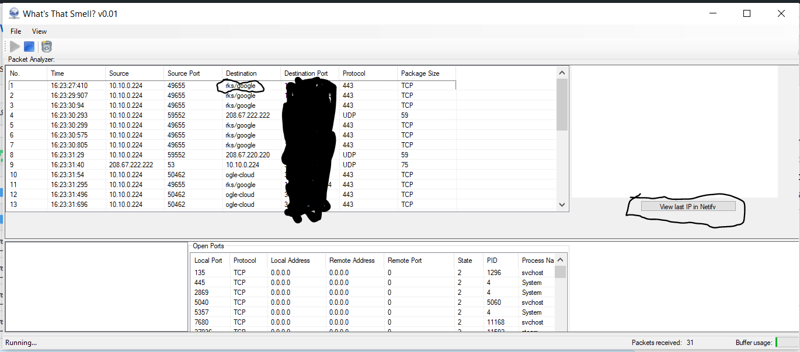

# whats-that-smell
A simple packet sniffer for analyzing local traffic and associating applications with IP addresses via Netify. 

To start the analysis, press the play button in the top left corner.

Then you will see a window to select the IP address on your computer that you would like to analyze (usually there is one working option).
The buffer overflow option (circled) allows you to pick how many packets are processed asychronously at any given time before they are erased.
Usually 1000 is plenty.

After this you will be able to view applications and websites in the "destination" section of the ListView (left), 
and view the IP of the last analyzed packet on Netify on the website (right)

